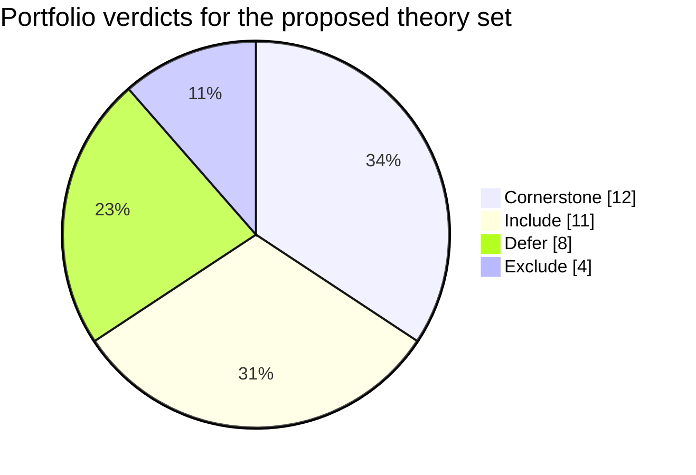
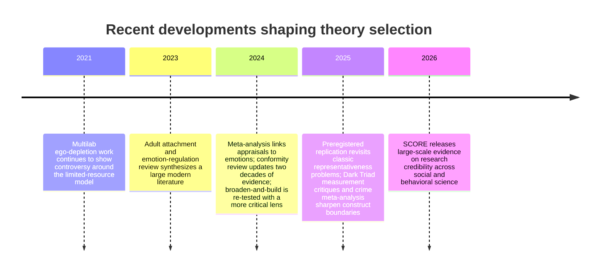

# Psychology Theory Landscape for a Consumer Psychology Literacy App

## Executive summary

The most useful way to answer your brief is to prioritize one central question: **which psychological theories give the best explanatory value-to-complexity ratio for a non-clinical adult audience after the replication crisis?** On that criterion, the field does not look like a flat menu of equally good options. It looks like a pyramid of evidence quality. Broadly, the strongest candidates are **dimensional trait models, motivational need/process models, attachment dimensions, emotion-regulation models, social-identity models, self-efficacy, self-compassion, and selected judgment-and-decision frameworks**. By contrast, **categorical typing systems, rigid stage models, broad folk-popular pyramids, and several once-famous social-psychology effects require heavy caveats or exclusion**. citeturn21search4turn21search7turn14search8turn29view5

Across entity["organization","American Psychological Association","us psychology association"] guidance, entity["organization","OpenStax","rice university project"] introductory texts, and the Noba recommendations, psychology is commonly organized into biological/neuroscience, cognition/learning, development, social/personality, motivation/emotion, and mental/physical health domains. For your product, the best reorganization is not to mirror departments exactly, but to extract the adult-life-relevant spine: **personality, motivation, attachment/relationships, cognition/judgment, emotion regulation, social identity/influence, and self-beliefs/self-concept**. citeturn0search0turn22search1turn22search8turn22search14

My strongest recommendation is to build the app around a **core set of cornerstone theories**: **Big Five**, **Self-Determination Theory**, **Goal-Setting Theory** as an applied layer, **adult attachment dimensions**, **cognitive dissonance**, **heuristics and biases** with updated caveats, **the cognitive behavioral model**, **Gross’s process model of emotion regulation**, **Social Identity Theory**, **social comparison**, **self-compassion**, and **self-efficacy**. These theories are comparatively strong on post-2015 standing, parsimony, everyday usefulness, and explainability. citeturn14search8turn2search13turn19search3turn13search0turn32search25turn16view12turn34search7turn17search3turn29view8turn8search14turn20search6turn20search3

Theories and findings that should be **excluded from the core** or taught only as “popular but revised” include **Myers-Briggs**, **Type A/B personality**, **Maslow’s rigid hierarchy**, **ego depletion**, **power posing**, and **terror management theory as a headline framework**. **Milgram-style obedience**, **stereotype threat**, **grit**, and **broaden-and-build** are not worthless, but their popular versions are too broad, too inflated, or too detached from current expert caution to sit at the center of the product. citeturn28search0turn27search1turn29view0turn5search0turn5search2turn16view15turn12search2turn4search14turn30search2turn16view10

## Research framing and evidence standards

I treated your brief as a product-design problem rather than a literature-history problem. The question was not “what has been influential in psychology?” but **“what deserves priority placement for educated adults who want to understand themselves, others, relationships, motivation, and clearer thinking?”** That distinction matters, because introductory courses still teach many historically important ideas that are not the best foundation for a modern literacy app. citeturn22search1turn22search14

The evidence standard used here was four-part: **empirical robustness** after the replication crisis, **meta-analytic support**, **cross-cultural generalization when available**, and **everyday applicability**. Since the entity["organization","Center for Open Science","research reform nonprofit"] SCORE program and related meta-science work continue to show that a substantial share of published social and behavioral findings do not cleanly replicate, famousness is not a good enough filter. Replication quality, cumulative evidence, and construct clarity now matter much more than textbook fame. citeturn29view9turn21search7turn21search3turn21search19

| Major source or position | How it organizes psychology | Implication for your app |
|---|---|---|
| APA subfields guidance | Many specializations, including cognitive, developmental, biopsychology, clinical, social/personality, school, health, forensic, I/O, and more. citeturn0search0 | Useful as a map of the full field, but too granular and profession-focused for a consumer product. |
| OpenStax Intro Psych model | Standard intro coverage across biology, sensation/perception, learning, memory, cognition, development, motivation/emotion, personality, social, disorders, and treatment. citeturn22search1turn22search13 | Good picture of teaching consensus, but still broader than everyday adult literacy needs. |
| Noba introductory recommendations | Emphasizes broad “pillars” such as biological, cognitive, developmental, social/personality, and mental/physical health. citeturn22search8 | Stronger fit for product architecture because it favors broad domains over department silos. |
| Open-science credibility position | Prioritize theories backed by replications, meta-analyses, transparent methods, and cross-sample robustness. citeturn29view9turn21search5 | This should be your curation rule. Build around cumulative programs, not iconic one-off findings. |

The most important operational definitions for your UI are these. **Trait/taxonomy models** describe stable individual differences. **Needs/motivational models** explain what energizes and sustains behavior. **Dimensional models** place people on continua rather than in boxes. **Process models** describe how perception, emotion, or reasoning unfolds over time. **Social/situational models** explain how context, groups, and norms shape behavior. **Stage models** are development-over-time frameworks, but these were usually weaker for your purposes unless treated as historical heuristics rather than core engines. citeturn16view3turn24search10turn13search0turn31search4turn29view8turn9search1

## Domain map

| Domain | Typical academic label | Relevance to everyday life | Empirical maturity | Recommended for inclusion | Rationale |
|---|---|---:|---:|---:|---|
| Personality and individual differences | Personality psychology / individual differences | High | High | Yes | Broad trait models are among the most stable, cross-culturally studied, and behaviorally useful parts of psychology. citeturn14search8turn29view5 |
| Motivation and self-regulation | Motivation / work and organizational / educational psychology | High | High | Yes | SDT, goal setting, and self-efficacy directly support behavior change, persistence, and wellbeing. citeturn2search13turn19search3turn20search3 |
| Attachment and close relationships | Attachment research across developmental, social, and personality psychology | High | Moderate to High | Yes | Attachment dimensions are highly relevant to adult relationships and connect strongly to emotion regulation and wellbeing. citeturn13search0turn24search1 |
| Cognition and judgment | Cognitive psychology / judgment and decision making | High | Moderate to High | Yes | Bias literacy, dissonance, and fast-slow processing have strong lay value, though some umbrella formulations need caveats. citeturn16view12turn31search3turn32search25 |
| Emotion and emotion regulation | Emotion science / affective science | High | High | Yes | Emotion regulation is one of the clearest bridges from theory to daily life, coping, and relationships. citeturn17search3turn17search15 |
| Social identity and influence | Social psychology | High | Moderate | Yes | Social identity, comparison, conformity, and bystander processes explain much of daily interpersonal behavior and online life. citeturn29view8turn8search14turn12search3turn16view5 |
| Self and identity | Self psychology / self processes | High | Moderate | Yes | Self-efficacy and self-compassion are strong; self-concept is broad but still highly useful. citeturn20search3turn20search6turn13search19 |
| Development and lifespan | Developmental psychology | Medium | Moderate | Defer | Important historically, but many flagship stage theories are less central to a non-clinical adult product than trait, process, and relationship models. citeturn22search1turn9search18turn9search12 |
| Biological and neuroscience foundations | Biopsychology / neuroscience / sensation and perception | Medium | High | Defer | Scientifically mature, but usually too distant from the explanatory goals of self-understanding and relationship literacy unless translated carefully. citeturn0search0turn22search1 |
| Clinical disorders and treatment systems | Abnormal psychology / psychotherapy / health psychology | Medium | Moderate to High | Defer | Highly important scientifically, but outside your non-clinical scope except where general models like CBT have strong lay transfer. citeturn34search7turn34search8 |

The clearest conclusion from the map is that **“social/personality” is too coarse for your product**, while **“development” and “biological” are too broad or too indirect** for MVP status. Your strongest architecture is to **split personality from social, split attachment from development, and split emotion regulation from generic emotion theory**. That reorganization matches both the evidence base and the user jobs implied by the brief. citeturn0search0turn22search8turn13search0turn17search3

## Theory scorecard

**Legend:** Parsimony / Applicability / Accessibility use **High, Medium, Low**.

| Theory | Domain | Robustness post-replication | Parsimony | Applicability | Accessibility | Verdict | One-line rationale |
|---|---|---|---|---|---|---|---|
| Big Five / OCEAN | Personality | Strong | High | High | High | Cornerstone | Best-supported broad trait map; strong cross-cultural work and clear links to regulation, behavior, and wellbeing. citeturn14search8turn29view5 |
| HEXACO | Personality | Strong | Medium | Medium | Medium | Include | Adds honesty-humility and often improves prediction of aversive and prosocial tendencies, but is less mainstream for consumers. citeturn16view3turn14search21 |
| Dark Triad | Personality | Moderate | Medium | Medium | Medium | Include | Useful for socially aversive tendencies, but measurement and construct-overlap issues make it a secondary layer, not a foundation. citeturn15search0turn29view4 |
| Type A/B personality | Personality | Weak | Low | Low | High | Exclude | Historical and categorical; later reviews cut against its broad explanatory value, and dimensional trait models supersede it. citeturn27search1 |
| Myers-Briggs Type Indicator | Personality | Weak | Medium | Low | High | Exclude | Popular and memorable, but psychometrically inferior to dimensional trait models and too dependent on typing logic. citeturn28search0turn14search3 |
| Self-Determination Theory | Motivation | Strong | High | High | High | Cornerstone | One of the best modern motivation frameworks: autonomy, competence, and relatedness generalize well and fit real life. citeturn2search13turn24search10 |
| Maslow’s Hierarchy of Needs | Motivation | Weak | Medium | Medium | High | Exclude | Needs matter, but the rigid pyramid and sequential structure are not well supported empirically. citeturn29view0 |
| Goal-Setting Theory | Motivation | Strong | Medium | High | High | Include | Applied evidence is robust, especially for specific, challenging goals with feedback, but it is narrower than SDT. citeturn19search3turn18search17 |
| Regulatory Focus Theory | Motivation | Moderate | Medium | Medium | Medium | Include | Promotion/prevention framing is useful and supported, but the theory is less comprehensive than SDT or goal-setting. citeturn19search0turn19search14 |
| Expectancy Theory | Motivation | Moderate | Medium | Medium | Medium | Defer | Influential in work motivation, but more instrumental and narrower than the highest-yield general-audience theories. citeturn18search0 |
| Grit | Motivation | Weak | Medium | Medium | High | Defer | Memorable, but much of its predictive value overlaps with conscientiousness and perseverance constructs already covered elsewhere. citeturn30search2turn30search1 |
| Bowlby’s Attachment Theory | Attachment | Strong | Medium | High | Medium | Include | Foundational account of the attachment system; best used as background for adult attachment dimensions. citeturn13search0turn13search12 |
| Adult Attachment Theory | Attachment | Strong | High | High | High | Cornerstone | One of the best relationship lenses for adults, with large literatures on closeness, conflict, support, and wellbeing. citeturn13search0turn29view7 |
| Attachment styles: secure, anxious, avoidant, disorganized | Attachment | Moderate | High | High | High | Cornerstone | Extremely useful for lay understanding, but adult “disorganized” measurement is less mature than anxious/avoidant dimensions. citeturn24search1turn13search6 |
| Dual Process Theory | Cognition | Moderate | High | High | High | Include | Very useful as an organizing metaphor for fast and slow thinking, but current experts treat it as a family of theories, not one settled system. citeturn31search3turn31search16 |
| Cognitive dissonance | Cognition | Strong | High | High | High | Cornerstone | Still one of the most elegant explanations of rationalization, hypocrisy, and self-justification, with continuing applied use. citeturn32search25turn32search23 |
| Attribution theory | Cognition | Moderate | Medium | High | High | Include | Broad and still useful for explaining how people infer causes and commit dispositional errors in daily life. citeturn33search12turn33search4 |
| Heuristics and biases | Cognition | Strong | Medium | High | High | Cornerstone | Many classic bias effects remain robust, but they should be taught as bounded tendencies rather than universal irrationality. citeturn16view12turn10search22 |
| Cognitive behavioral model | Cognition | Strong | High | High | High | Cornerstone | The thought-emotion-behavior loop is highly teachable and anchored in one of psychology’s strongest applied traditions. citeturn34search7turn34search8turn34search6 |
| Appraisal Theory | Emotion | Moderate | Medium | High | Medium | Include | Supported by recent meta-analytic work and useful for explaining why the same event produces different emotions in different people. citeturn17search2 |
| Constructed Emotion Theory | Emotion | Moderate | Medium | Medium | Low | Defer | Influential and intellectually important, but still a major live debate rather than a settled consumer-facing cornerstone. citeturn17search4turn17search8 |
| Broaden-and-Build Theory | Emotion | Moderate | Medium | Medium | High | Defer | Positive emotions clearly link to resources and wellbeing, but the “broadening” mechanism itself is less cleanly supported than the popular story suggests. citeturn16view10 |
| Emotion regulation process model | Emotion | Strong | High | High | High | Cornerstone | One of the clearest and most practical emotion theories, with broad evidence around reappraisal, suppression, and mental health. citeturn17search3turn17search15turn6search5 |
| Social Identity Theory | Social | Strong | High | High | Medium | Cornerstone | Extremely useful for group belonging, polarization, norms, and health behavior; broad value in modern social life. citeturn29view8turn25search5 |
| Social comparison theory | Social | Strong | High | High | High | Cornerstone | Especially valuable in the social-media era; comparisons strongly shape self-evaluation, body image, and mood. citeturn8search14turn26search15 |
| Bystander effect / diffusion of responsibility | Social | Strong | Medium | Medium | High | Include | The effect is real, but real-world data show the story is more contextual than the folk version suggests. citeturn12search3turn35search12turn35search4 |
| Conformity and obedience | Social | Moderate | Medium | High | High | Include | Conformity remains robust; obedience is useful, but classic Milgram numbers should be taught as context-bound, not timeless. citeturn16view5turn12search2 |
| Self-concept and self-schemas | Self | Moderate | Medium | High | Medium | Include | Broad but highly useful: how people encode “who I am” shapes attention, memory, interpretation, and identity dynamics. citeturn13search19turn8search5 |
| Terror Management Theory | Self | Weak | Medium | Low | Medium | Exclude | Historically influential, but mortality-salience claims have faced notable replication problems and should not anchor your product. citeturn16view15 |
| Self-compassion | Self | Strong | High | High | High | Cornerstone | Strong links to wellbeing and distress reduction, plus unusually clear translatability into practical daily exercises. citeturn20search6turn20search23turn20search5 |
| Self-efficacy | Self | Strong | High | High | High | Cornerstone | A powerful, parsimonious belief-based construct with broad applied use across health, learning, work, and persistence. citeturn20search3turn26search3turn26search9 |
| Erikson’s psychosocial stages | Development | Weak | Medium | Medium | High | Defer | Historically important and intuitive, but too stage-like and weakly grounded for core placement in a modern adult app. citeturn9search1turn9search12 |
| Piaget’s cognitive development | Development | Weak | Medium | Medium | Medium | Defer | Foundational historically, but strict stage claims have been narrowed substantially by later work. citeturn9search18turn9search3 |
| Vygotsky’s social development | Development | Moderate | Medium | Medium | Medium | Defer | Valuable for learning and scaffolding, but less central than adult-facing trait, motivation, and relationship theories. citeturn9search13 |
| Adult development / post-formal thought | Development | Weak | Low | Medium | Low | Defer | Interesting, but conceptually fragmented and not yet strong enough as a core explanatory module for general adults. citeturn9search10turn9search14 |

The distribution above shows the basic design lesson: **the strongest portfolio is dominated by dimensional and process models**, not by typologies, rigid stage theories, or iconic one-effect claims. That is exactly what one would expect in a post-replication, meta-analytic curation strategy. citeturn21search4turn14search8turn17search3turn29view8

## Replication watch list and recent developments

The last five years have reinforced a simple rule for theory curation: **do not build consumer products around flashy findings that were optimized for surprise rather than cumulative robustness**. Large-scale credibility work from SCORE, along with domain-specific replications and meta-analyses, points toward transparent, cumulative, cross-sample frameworks and away from one-shot claims. citeturn29view9turn21search7turn21search3

| Theory or finding | Current expert view | Status for your app |
|---|---|---|
| Ego depletion | The broad “limited self-control resource” story has not held up cleanly; replications are mixed and effect sizes appear small or task-dependent. citeturn5search0turn5search8turn5search5 | Exclude from core. If mentioned, teach as an example of why replication matters. |
| Power posing | The strong hormonal and behavioral claims did not survive well; at most, there may be narrower self-perception effects. citeturn5search2turn4search17turn4search21 | Exclude. |
| Stereotype threat | Real in some domains and settings, but scope and effect size are more bounded than early popular accounts suggested. citeturn4search14 | Caveat heavily; do not use as a master explanation of performance gaps. |
| Milgram generalizability | Obedience under authority remains meaningful, but the famous 65% should not be treated as a timeless estimate of ordinary human behavior. citeturn12search2turn4search23 | Include only with context and moderation. |
| Maslow’s hierarchy | Needs matter; the rigid pyramid and “first things first” progression do not. citeturn29view0 | Exclude from core; mention as revised history. |
| Myers-Briggs | Some score reliabilities are acceptable, but the typing logic and validity are still weak relative to dimensional personality science. citeturn28search0turn28search11 | Exclude from scientific core. |
| Type A/B personality | Broad A/B typing has limited modern value; hostility and stress reactivity are better treated as narrower components. citeturn27search1turn27search4 | Exclude. |
| Grit | Better viewed as a repackaging of perseverance/conscientiousness than as a distinct flagship construct. citeturn30search2turn30search1 | Defer or absorb into conscientiousness and goal persistence. |
| Terror Management Theory | Still cited, but recent registered work has amplified concerns around key mortality-salience claims. citeturn16view15 | Exclude from the main ladder. |

Three recent trends matter most for your content roadmap. First, **meta-science has become infrastructure**: evidence badges such as “meta-analyzed,” “cross-cultural,” and “registered replication support” are now more informative than popularity. Second, **cross-cultural testing has expanded** in personality, emotion regulation, and social identity research, which matters for a general-audience app. Third, **classic social findings are increasingly checked against real-world data**, not just laboratory analogues. citeturn21search4turn14search8turn17search3turn29view8turn35search12

These milestones point toward a practical content policy: **prefer cumulative programs over iconic studies, dimensions over boxes, and mechanisms over folklore**. citeturn24search1turn17search2turn16view5turn16view10turn16view12turn29view4turn15search0turn29view9

## Structural taxonomy and cross-domain connections

The structural taxonomy below matters because it tells you how each theory should be visualized. **Trait and dimensional theories want sliders and profiles. Need theories want deficits and resource dashboards. Process theories want loops, flows, and intervention points. Social theories want networks, norms, and context maps.** That translation from theory type to UI is as important as the theory choice itself. citeturn16view3turn24search10turn31search4turn29view8

| Theory | Structural type | Best UI representation |
|---|---|---|
| Big Five | Trait / taxonomy | Five sliders or radar profile |
| HEXACO | Trait / taxonomy | Six sliders plus honesty-humility highlight |
| Dark Triad | Trait / taxonomy | Secondary “social risk” sliders |
| Self-Determination Theory | Needs / motivational | Three-need dashboard |
| Goal-Setting Theory | Process / motivational | Goal loop with clarity, challenge, feedback |
| Regulatory Focus Theory | Dimensional / continuous | Promotion–prevention slider |
| Bowlby attachment theory | Needs / motivational | Attachment system overview card |
| Adult Attachment Theory | Dimensional / continuous | Anxiety × avoidance 2D map |
| Attachment styles | Dimensional / continuous | Quadrant derived from the 2D map |
| Dual Process Theory | Process / cognitive | Fast vs slow pathway toggle |
| Cognitive dissonance | Process / cognitive | Belief-action tension loop |
| Attribution theory | Process / cognitive | Internal vs external cause map |
| Heuristics and biases | Process / cognitive | Bias cards grouped by inference shortcut |
| Cognitive behavioral model | Process / cognitive | Thought–emotion–behavior loop |
| Appraisal Theory | Process / cognitive | Event → interpretation → emotion map |
| Emotion regulation process model | Process / cognitive | Timeline of strategy “entry points” |
| Social Identity Theory | Social / situational | Identity circles and in-group maps |
| Social comparison theory | Social / situational | Upward/downward comparison ladder |
| Bystander effect | Social / situational | Responsibility diffusion network |
| Conformity and obedience | Social / situational | Norm pressure and authority map |
| Self-concept / self-schemas | Process / cognitive | Self-belief schema network |
| Self-compassion | Dimensional / continuous | Low-high gauge and practice tracker |
| Self-efficacy | Dimensional / continuous | Confidence-by-domain meter |

| Theory A ↔ Theory B | Connection | Why it matters for a lay user |
|---|---|---|
| Big Five neuroticism ↔ emotion regulation | Neuroticism strongly relates to more maladaptive and less adaptive regulation strategies. citeturn29view5turn24search3 | Teaches that a trait is a tendency, not a destiny; regulation skills are the intervention lever. |
| Attachment insecurity ↔ emotion regulation | Secure attachment tracks more balanced regulation, while insecurity tracks hyperactivation, suppression, and dysregulation. citeturn24search1turn24search5 | Explains why “relationship style” often shows up as emotional habits during conflict. |
| Attachment security ↔ SDT relatedness | Secure relationships help satisfy relatedness and support wellbeing and internalization. citeturn24search22turn2search13 | Helps users see that close bonds are not just comforting; they are motivational infrastructure. |
| Goal setting ↔ self-efficacy | Confidence affects goal choice and persistence, and goals can in turn build efficacy beliefs. citeturn26search3turn20search3turn26search9 | Suggests apps should pair goals with “small wins,” not only targets. |
| Conscientiousness ↔ grit | Much of grit’s claimed power overlaps with conscientiousness and persistence facets. citeturn30search2turn30search1 | Prevents redundant content and keeps the model cleaner. |
| Social identity ↔ self-concept | Group belonging becomes part of self-definition and behavior regulation. citeturn29view8turn25search5 | Explains why behavior change often works better when identity, not just willpower, shifts. |
| Social comparison ↔ self-compassion | Self-compassion can buffer the emotional harms of comparison, especially upward comparison. citeturn26search0turn26search14turn20search6 | Useful for social-media literacy and self-worth protection. |
| Attribution theory ↔ heuristics and biases | Attribution errors are one important family of everyday judgment bias. citeturn33search12turn16view12 | Connects “why I misread others” to bias literacy and empathy. |
| HEXACO honesty-humility ↔ Dark Triad | Low honesty-humility partly explains why dark-trait measures predict manipulation and antisocial behavior. citeturn16view3turn15search0turn29view4 | Lets you teach aversive tendencies within a broader trait framework instead of isolated labels. |

The biggest cross-domain design lesson is that **trait models tell users what they are prone to do, while process models tell users where they can intervene**. Your best product will repeatedly connect those two levels. citeturn14search8turn17search3turn20search3

## Recommended domain set

The product should be organized around **domains of user need**, not around department history. For your audience, the highest-yield final domain set is:

| Option | Recommended final domains | Rationale |
|---|---|---|
| 4-domain MVP | **Personality and self-beliefs**; **Motivation and behavior change**; **Attachment and relationships**; **Thinking and emotion management** | This covers self-understanding, relationship patterns, motivation, clearer thinking, and emotional coping with the fewest moving parts. It also captures most of the strongest theories in the scorecard. citeturn14search8turn2search13turn13search0turn17search3turn20search3 |
| 6-domain full version | **Personality and individual differences**; **Motivation and self-regulation**; **Attachment and close relationships**; **Cognition and judgment**; **Emotion and emotion regulation**; **Social identity, comparison, and self-concept** | This is the most evidence-aligned architecture for your brief. It stays close to mainstream psychology while being much more intuitive for adult users. citeturn22search8turn29view8turn8search14turn20search6 |

My concrete recommendations are these. First, **build the learning path around the cornerstones**, not around historical celebrities or viral ideas. Second, **teach dimensions instead of boxes**: users should leave with sliders, gradients, and situational tendencies, not permanent labels. Third, **separate foundational theories from “popular but revised” theories** so users learn the difference between psychological folklore and current consensus. Fourth, **add evidence badges** for replication strength, meta-analytic support, and cross-cultural testing. Fifth, **tie every theory to one practical question**: What does this explain? What can I notice? What can I change? Sixth, **reserve developmental stage theories for enrichment content**, not homepage real estate. citeturn21search4turn14search8turn28search0turn29view0

The key stakeholders are straightforward. **Users** need clarity without oversimplification. **Content designers** need a taxonomy that maps cleanly to UI. **Scientific advisors and editors** need evidence standards that survive scrutiny. **Educators, coaches, and adjacent practitioners** need theories that travel well into everyday settings without drifting into pseudoscience. Your architecture should make all four groups happy by using a visible “strong / moderate / caution” evidence language. citeturn21search3turn21search19

**Open questions and limitations.** Cross-cultural evidence is uneven across theories; adult “disorganized attachment” still has thinner measurement support than anxious/avoidant dimensions; self-concept is more a family of constructs than one tightly bounded theory; and developmental theories remain foundational in education even when they are not ideal for your specific product goal. The report therefore favors theories with the clearest combination of strong evidence and consumer usefulness, not theories with the deepest historical footprint. citeturn13search6turn13search19turn22search1

**Suggested next steps.** The next practical move is to turn the theory list into a content matrix with four columns: **core insight, strongest use case, common misuse, and best UI pattern**. If you do that, this literature map will immediately become a product roadmap. citeturn16view3turn29view8turn20search3

## Full citations

American Psychological Association. “Psychology subfields.” APA Education and Careers webpage. citeturn0search0

American Psychological Association. “APA Introductory Psychology Initiative.” APA Education webpage. citeturn22search0

American Psychological Association. “Self-Determination Theory.” APA Research in Action webpage. citeturn2search13

American Psychological Association. “Self-Efficacy: The Theory at the Heart of Human Agency.” APA Research in Action webpage, October 22, 2025. citeturn20search3

Barańczuk, U. “The five factor model of personality and emotion regulation: A meta-analysis.” *Personality and Individual Differences* 139 (2019): 217–227. doi:10.1016/j.paid.2018.11.025. citeturn29view5

Barrett, L. F. “The Theory of Constructed Emotion: More Than a Feeling.” *Perspectives on Psychological Science* (2025). citeturn17search8

Beck, A. T., and E. A. P. Haigh. “Advances in cognitive theory and therapy: The generic cognitive model.” *Annual Review of Clinical Psychology* 10 (2014): 1–24. doi:10.1146/annurev-clinpsy-032813-153734. citeturn34search6

Bonfanti, R. C., et al. “A systematic review and meta-analysis” on social comparison and body image/eating outcomes. *Body Image* (2025). citeturn8search14

Capuano, C., et al. “A Systematic Review of Research on Conformity.” *International Review of Social Psychology* 37, no. 1 (2024). doi:10.5334/irsp.874. citeturn16view5

Center for Open Science. “Large-Scale Collaboration Releases New Findings on Research Credibility.” April 1, 2026. citeturn21search4

Credé, M., M. C. Tynan, and P. D. Harms. “Much ado about grit: A meta-analytic synthesis of the grit literature.” *Journal of Personality and Social Psychology* 113, no. 3 (2017): 492–511. citeturn30search2

de Hoog, N., and R. Pat-El. “Social identity and health-related behavior: A systematic review and meta-analysis.” *Social Science & Medicine* 347 (2024): 116629. doi:10.1016/j.socscimed.2024.116629. citeturn29view8

Eilert, D. W., and A. Buchheim. “Attachment-Related Differences in Emotion Regulation in Adults: A Systematic Review on Attachment Representations.” *Brain Sciences* 13 (2023): 884. citeturn24search5

Erford, B. T., J. Zhang, et al. “A 25-Year Review and Psychometric Synthesis of the Myers-Briggs Type Indicator (MBTI) Form M.” *Journal of Counseling & Development* (2025). citeturn28search0

Fischer, P., et al. “The bystander-effect: A meta-analytic review on bystander intervention in dangerous and non-dangerous emergencies.” *Psychological Bulletin* 137, no. 4 (2011): 517–537. citeturn12search3

Fraley, R. C. “Attachment in Adulthood: Recent Developments, Emerging Debates, and Future Directions.” *Annual Review of Psychology* 70 (2019): 401–422. citeturn13search0

Hampejs, V., et al. “The Dark Triad of personality and criminal and delinquent behavior: A preregistered systematic review and three-level meta-analysis.” *Personality and Individual Differences* (2025). citeturn15search0

Hochman, G. “Beyond the Surface: A New Perspective on Dual-System Theories in Decision-Making.” *Behavioral Sciences* (2024). citeturn31search3

Hu, J., et al. “Social identity and social integration: a meta-analysis exploring the relationship between social identity and social integration.” *Frontiers in Psychology* (2024). citeturn25search5

Kleingeld, A., H. van Mierlo, and L. Arends. “The Effect of Goal Setting on Group Performance: A Meta-Analysis.” *Journal of Applied Psychology* 96, no. 6 (2011): 1289–1304. citeturn19search3

Latham, L., and Z. Stephenson. “A Critical Review of the Short Dark Triad (SD3).” *Journal of Psychopathy Research* (2025). doi:10.1177/27000710251388327. citeturn29view4

Liebst, L. S., et al. “Would I Be Helped? Cross-National CCTV Footage Shows That Intervention Is the Norm in Public Conflicts.” *American Psychologist* 75, no. 1 (2020): 66–75. citeturn35search12

Lindegaard, M. R., et al. “Does Danger Level Affect Bystander Intervention in Real-Life Conflicts? Evidence From CCTV Footage.” *Social Psychological and Personality Science* 13, no. 4 (2022). citeturn35search4

Mayiwar, L., K. H. Wan, E. Løhre, and G. Feldman. “Revisiting representativeness heuristic classic paradigms: Replication and extensions of nine experiments in Kahneman and Tversky (1972).” *Quarterly Journal of Experimental Psychology* (2025). citeturn16view12

Minnigh, T. L., et al. “Grit as a predictor of academic performance: Not much more than conscientiousness.” *Personality and Individual Differences* (2024). citeturn30search1

Motyka, S., et al. “Regulatory fit: A meta-analytic synthesis.” *Journal of Consumer Psychology* 24, no. 3 (2014): 394–410. citeturn19search0

Noba Project. “Recommendations for Introductory Psychology.” Teaching document. citeturn22search8

OpenStax. *Psychology 2e.* Rice University, 2020 edition webpage and related course materials. citeturn22search1turn22search13

O’Toole, M. S., et al. “Cognitive behavioral therapies are evidence-based – based on what? A systematic review and meta-analysis of recent randomized controlled trials of cognitive behavioral therapies for depression.” *Journal of Affective Disorders* (2025). citeturn34search8

Permzadian, V., et al. “Assessing the predictive validity of expectancy theory for work motivation.” *Behavioral Sciences* (2024). citeturn18search0

Petticrew, M. P., et al. “Type A Behavior Pattern and Coronary Heart Disease.” *American Journal of Public Health* 102, no. 11 (2012): 2012–2015. citeturn27search1

Pollard, C., et al. “A systematic review of measures of adult disorganized attachment.” *British Journal of Clinical Psychology* (2023). citeturn13search6

Rojas, M. “The hierarchy of needs: empirical examination of Maslow’s theory and lessons for development.” *World Development* 165 (2023): 106185. citeturn29view0

Roth, L. H. O., et al. “Testing the validity of the broaden-and-build theory of positive emotions: a network analytic approach.” *Frontiers in Psychology* (2024). citeturn16view10

Schindler, S., N. Reinhardt, and M.-A. Reinhard. “Defending one’s worldview under mortality salience: Testing the validity of an established idea.” *Journal of Experimental Social Psychology* 93 (2021): 104087. citeturn16view15

Sheppard, H., et al. “Understanding and assessing personality across cultures.” *Annual Review of Psychology* (2026). citeturn14search8

Van den Broeck, A., et al. “A Review of Self-Determination Theory’s Basic Psychological Needs at Work.” *Journal of Management* 42, no. 5 (2016): 1195–1229. citeturn24search10

Williamson, O., et al. “The performance and psychological effects of goal setting.” *Sports Coaching Review* (2024). citeturn26search6

Yeo, G. C., et al. “Associations between cognitive appraisals and emotions: A meta-analytic review.” *Psychological Bulletin* (2024). citeturn17search2

Zárate-Torres, R., et al. “How good is the Myers-Briggs Type Indicator for predicting leadership-related behavior?” *Frontiers in Psychology* (2023). citeturn14search3

Zessin, U., M. Dickhäuser, and A. Garbade. “The Relationship Between Self-Compassion and Well-Being: A Meta-Analysis.” *Applied Psychology: Health and Well-Being* 7, no. 3 (2015): 340–364. citeturn20search6